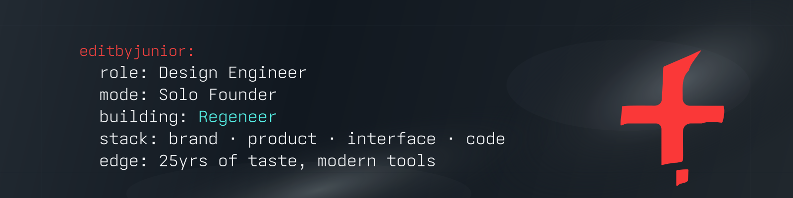

# Hey there

📍 Orange County <-> SF, Bay Area

My name is Elder Jerez Jr., but I go by Junior. ☕️ I’ve spent the last 25 years living in that quiet space between pixels and people, architecting the parts of software that users feel before they understand why. Brand. Interaction. Emotional weight. The controlled power that only real experience can deliver.

[Extended Bio](./Extended-Bio.md) · [X](https://x.com/editbyjunior) · [LinkedIn](https://www.linkedin.com/in/elderjerezjr/)

---

## Currently

- Building: Regeneer, Micro Resorts, Soundlites.

## Let's Connect

- Email: [jr@editbyjunior.com](mailto:jr@editbyjunior.com) — always interested in collaborating with builders and tinkerers.

## Things I'm Proud Of

- 4X Dad: Step-dad of 3, Dad of 1.
- [2Advanced](https://www.2advanced.com): pushed pixels and led teams on large-scale projects from 2005-2014.
- Founder & Designer at Progressive One, LLC, a fractional agency of one for web2 and web3 brands. 12 years and counting.
- Curated brand, product, and interactive work for Adobe, Disney, NBA, Nintendo, Activision, LucasArts, Google, Mattel, Marvel, SpaceX, MTV, Pepsi, Sony, Samsung, Kabam, Nvidia, Warner Bros, Lego, ASUS, Treyarch, and more.

## Stack

## Quote

> I come from the last generation before the internet went mainstream. We drank from the fire hose, played outside, and learned to build while the rules were still loading.

---

_This README is a living document that evolves with the work._
